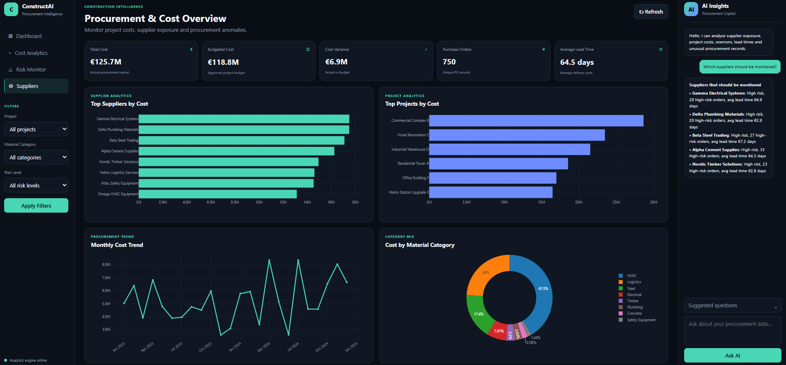
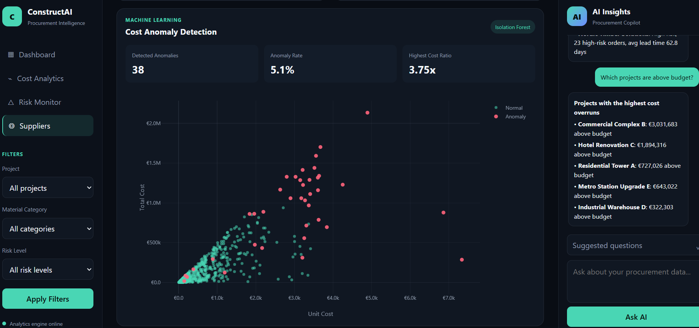
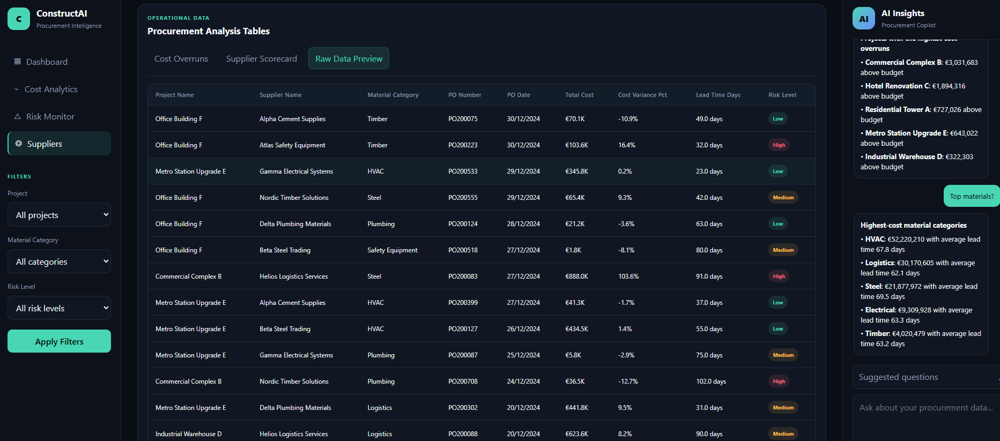

# Construction Procurement & Cost Assistant

A production-oriented AI and analytics application for construction procurement and project cost control.

This project helps construction, procurement, and cost-control teams analyze purchasing data, identify supplier and contractor risks, detect unusual cost increases, monitor project budget overruns, and generate business insights through an interactive dashboard and a natural language assistant.

## Application Preview

### Dashboard Overview
The main dashboard provides a consolidated view of construction procurement and project cost performance, including total procurement cost, budgeted cost, cost variance, purchase order activity, supplier exposure, project spend, monthly cost trends, and material category distribution.

The integrated AI Insights Assistant allows users to ask business-oriented questions directly against the procurement analytics layer.

### Machine Learning Anomaly Detection

The application integrates an Isolation Forest anomaly detection model to identify unusual procurement records based on cost, quantity, budget variance, and lead-time behaviour.

### AI Insights Assistant

Operational procurement records can be reviewed through interactive analysis tables 
covering cost overruns, supplier risk scoring, and raw procurement data.

## Project Goal

The goal of this project is to demonstrate an end-to-end AI Engineering and ML Engineering workflow in a practical business context.

The application is designed as a portfolio project for Junior AI Engineer, Data Analyst, BI Engineer, and ML Engineer roles.

## Key Features

Implemented:

- Modular Python project architecture
- Synthetic construction procurement data generation
- CSV and Excel data ingestion
- Data validation and cleaning pipeline
- Procurement and cost analytics
- Supplier risk scorecard
- Cost overrun analytics
- Isolation Forest anomaly detection
- Natural language analytics assistant
- FastAPI backend and REST endpoints
- HTML, CSS and JavaScript frontend
- Plotly.js interactive visualizations
- Interactive dashboard filters
- AI copilot-style assistant panel
- Unit tests with Pytest

## Example Business Questions

The assistant can answer questions such as:

- Which suppliers have the highest spend?
- Which projects have the highest procurement cost?
- Which projects are above budget?
- Which material categories show unusual price increases?
- Which suppliers have the longest delivery delays?
- Which suppliers or contractors should be monitored?
- Show monthly construction procurement trends.
- Summarize procurement and cost risks automatically.

## Tech Stack

- Python
- FastAPI
- Pandas
- NumPy
- Scikit-learn
- HTML5
- CSS3
- Vanilla JavaScript
- Plotly.js
- Jinja2
- Uvicorn
- Pytest
- Git / GitHub

## Project Structure

backend/
    __init__.py
    main.py

frontend/
    templates/
        index.html
    static/
        css/
            style.css
        js/
            app.js

app/
    streamlit_app.py

data/
    sample/
    processed/

src/
    data/
    analytics/
    ml/
    assistant/

tests/
    test_spend_analysis.py
    test_assistant.py
    test_anomaly_detection.py

screenshots/
README.md
requirements.txt
pyproject.toml

## Flow
Synthetic Data Generation
        ↓
Data Ingestion & Validation
        ↓
Data Cleaning
        ↓
Analytics Layer
        ↓
Isolation Forest Anomaly Detection
        ↓
Natural Language Assistant Layer
        ↓
FastAPI REST API
        ↓
HTML / CSS / JavaScript Frontend

## How to Run 

On terminal: py -m uvicorn backend.main:app --reload
On browser:  Open http://127.0.0.1:8000